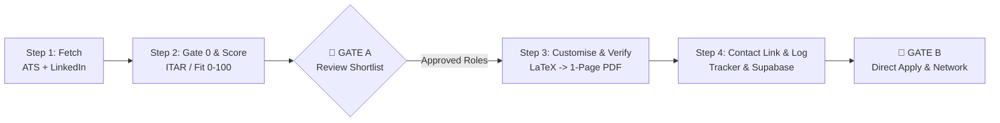

# 🚀 Job Application Agent

An autonomous, multi-agent AI job search, screening, and resume customization cockpit. Built to operate seamlessly with **Google Antigravity**, **Claude Code**, **OpenAI Codex**, or as a standalone CLI pipeline.

Designed to eliminate tedious manual job hunting through intelligent 2-track sourcing, strict Gate 0 eligibility checks (ITAR, citizenship, visa sponsorship), truth-grounded LaTeX resume tailoring, strict 1-page PDF validation, and automated networking contact discovery.

---

## 🏗️ Architecture & Pipeline Flow

The framework divides job applications into a 4-stage deterministic pipeline with human-in-the-loop gates:



### 1. Sourcing & Discovery (`fetcher` / `tools/fetch_jobs.py`)
- **Direct ATS Scraper**: High-performance, zero-token scans across 44+ direct ATS boards (Greenhouse, Lever, Workday, SmartRecruiters, Ashby, etc.) via vendored providers in `tools/lib/providers/`.
- **Apify LinkedIn Scraper**: Optional automated targeted queries for specific target companies and roles with configurable spend caps.
- **Deduplication Ledger**: Automatically skips previously evaluated jobs tracked in `seen_jobs.csv`.

### 2. Hard Gating & Fit Scoring (`ranker` / `tools/gate_and_score.py`)
- **Gate 0 (Eligibility Gating)**: Verbatim regex screening for ITAR restrictions, security clearances, U.S. citizenship requirements, and explicit "no sponsorship" disclaimers. Fails immediately to `VISA RISK (SKIP)` with the exact quoted snippet.
- **5-Axis Fit Scoring (0–100)**:
  - **Sponsorship Odds (30 pts)**: Cross-referenced against the embedded USCIS H-1B sponsor database (`data/uscis_h1b_lookup.json`).
  - **Role & Technical Fit (30 pts)**: Domain keyword density and qualification alignment.
  - **Seniority Fit (20 pts)**: Title and experience range matching.
  - **Domain Priority (10 pts)**: Priority alignment with wishlist domains.
  - **Logistics & Integrity (10 pts)**: Location, recency, and verified employer status.
- **Human Gate A**: You review the ranked shortlist (`.pipeline/ranked.md`) and select approved roles.

### 3. Truth-Grounded Customization (`customiser` / `tools/customise_resume.py`)
- **Truth-Only Customization**: All claims, bullet points, skills, and metrics are strictly grounded in your candidate database (`data/candidate_resume_database.json`). Never invents employers, credentials, or fake metrics.
- **Dynamic Semantic Reordering**: Surfaces the most JD-relevant skills, experience bullet points, and project case studies.
- **Strict Verification (`tools/verify_pdf.py`)**: Compiles via `pdflatex`, enforces strict 1-page limits, verifies ASCII date formatting, and inspects the extractable text layer for clean ATS parsing (no replacement glyphs or unescaped characters).
- **Directory Hierarchy**:
  - `Job_Applications_Resumes/<Month>/<YYYY-MM-DD>/Apply/`: Holds final verified PDFs ready for submission.
  - `Job_Applications_Resumes/<Month>/<YYYY-MM-DD>/Archive/`: LaTeX source files, compilation logs, and build artifacts.

### 4. Application Logging & Contact Discovery (`tools/log_and_refresh.py`)
- **1-Click Recruiter & Team-Lead Links**: Generates instant LinkedIn people-search URLs for hiring managers and recruiters per role.
- **Application Tracker**: Syncs to an interactive HTML tracker (`job_tracker.html`), optional Supabase database, or exportable Excel sheets (`networking_sheet.py`).

---

## ⚡ Quickstart Guide

### 1. Prerequisites
- **Python 3.10+**: Core engine scripts.
- **Node.js 18+**: For ATS board scanners.
- **TeX Live / MacTeX**: For compiling LaTeX resumes to PDF (`pdflatex` must be in your `PATH`).
  - macOS: `brew install --cask mactex-no-gui` or `brew install basictex`
  - Ubuntu/Debian: `sudo apt install texlive-latex-base texlive-latex-extra texlive-fonts-recommended`
  - Windows: Install [MiKTeX](https://miktex.org/) or TeX Live.

### 2. Installation
Clone the repository and install the lightweight Python dependencies:

```bash
git clone https://github.com/Siddardth7/job-application-agent.git
cd job-application-agent

# Create and activate a virtual environment
python3 -m venv .venv
source .venv/bin/activate

# Install dependencies
pip install -r requirements.txt
```

### 3. Configure Your Profile & Resume

1. **Candidate Master Data**:
   Copy and edit `data/candidate_resume_database.template.json` to `data/candidate_resume_database.json`:
   ```bash
   cp data/candidate_resume_database.template.json data/candidate_resume_database.json
   ```
   Fill in your actual work experience, verified metrics, projects, education, and contact details.

2. **Master LaTeX Resume**:
   Edit `Resume/Final_Resumes/Resume_NewStrategy_Master.tex` with your baseline resume structure. The customizer will use this as the master template.

3. **Target Portals & Gating (Optional)**:
   - Edit `tools/portals.json` to add or modify target company career portals.
   - Edit `company_intel.md` to add company-specific hiring rules or sponsorship policies.

4. **Environment Configuration (Optional)**:
   ```bash
   cp .env.example .env
   ```
   Add your optional `APIFY_TOKEN` (for LinkedIn scraping) or `SUPABASE_URL` / `SUPABASE_KEY` (for cloud database tracking). If not configured, the agent runs entirely offline/locally with zero paid APIs!

---

## 🖥️ Running the Pipeline

### Option A: Using the CLI Runner

```bash
# Run the interactive daily flow (Fetch -> Score -> Gate A -> Customize -> Log)
./tools/daily_run.sh

# Run individual stages independently:
./tools/daily_run.sh fetch        # Stage 1: Fetch jobs
./tools/daily_run.sh score        # Stage 2: Filter Gate 0 and score matches
./tools/daily_run.sh customize    # Stage 3: Customize approved shortlist
./tools/daily_run.sh sync         # Stage 4: Sync to tracker and export links
```

### Option B: Using AI Agents (Antigravity / Claude Code / Codex)

This repository includes native sub-agent definitions:
- **Google Antigravity**: Configured via `AGENTS.md` and workspace rules.
- **Claude Code**: Run commands directly in Claude Code:
  - `/apply-run`: Orchestrates the entire daily pipeline.
  - `/fetch`: Runs Stage 1 discovery.
  - `/rank`: Runs Stage 2 scoring.
  - `/customise`: Runs Stage 3 resume generation.
  - `/find-contacts`: Discovers networking targets.
- **OpenAI Codex**: Configured via `.codex/agents/*.toml`.

---

## 📁 Repository Structure

```
job-application-agent/
├── .claude/                  # Claude Code subagents & slash commands
├── .codex/                   # OpenAI Codex agent configurations
├── AGENTS.md                 # Orchestration rules & Antigravity configuration
├── DAILY_RUN.md              # Operational SOP handbook
├── data/
│   ├── candidate_resume_database.template.json  # Master profile schema
│   ├── candidate_resume_database.json           # Your active candidate inventory
│   └── uscis_h1b_lookup.json                    # H-1B sponsor database (Gate 0)
├── Resume/
│   └── Final_Resumes/
│       └── Resume_NewStrategy_Master.tex        # Master LaTeX template
├── tools/
│   ├── lib/                  # 44+ ATS scraping providers & trust engines
│   ├── ats_scan.mjs          # Zero-token direct ATS board scanner
│   ├── fetch_jobs.py         # Multi-pass job fetcher (ATS + Apify)
│   ├── gate_and_score.py     # Hard ITAR/visa gating & 0-100 rubric scoring
│   ├── customise_resume.py   # Truth-grounded LaTeX resume tailor
│   ├── verify_pdf.py         # LaTeX compiler & 1-page ATS PDF validator
│   ├── log_and_refresh.py    # Tracker updater & contact link generator
│   └── daily_run.sh          # All-in-one daily runner script
├── networking_sheet.py       # Excel / Supabase networking contact manager
├── refresh.py                # Dashboard & tracker artifact builder
├── requirements.txt          # Python dependencies
└── .env.example              # Environment variables template
```

---

## 🛡️ Core Rules & Ethics

1. **Human in the Loop**: The AI prepares resumes, inspects job criteria, and generates outreach links. You review every application and make the final submission.
2. **Strict Truthfulness**: Never hallucinate experiences or invent tools. Customization reorders and emphasizes existing verified qualifications to match JD language.
3. **No Spray-and-Pray**: Capped at a maximum of 2 roles per company per day to preserve candidate credibility and prevent ATS spam filters.

---

## 📄 License
MIT License. Open source and free to customize.
