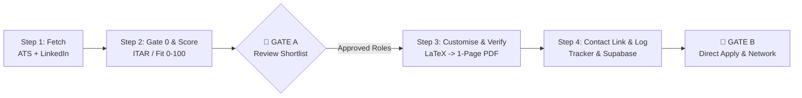

# 🚀 Job Application Agent

An autonomous, multi-agent AI job search, screening, and resume customization cockpit. Built to operate seamlessly with **Google Antigravity**, **Claude Code**, **OpenAI Codex**, or as a standalone CLI pipeline.

Designed to eliminate tedious manual job hunting through intelligent 2-track sourcing, strict Gate 0 eligibility checks (ITAR, citizenship, visa sponsorship), truth-grounded LaTeX resume tailoring, strict 1-page PDF validation, and automated networking contact discovery.

---

## 🏗️ Architecture & Pipeline Flow

The framework divides job applications into a 4-stage deterministic pipeline with human-in-the-loop gates:



### 1. Sourcing & Discovery (`fetcher` / `tools/fetch_jobs.py`)
- **Direct ATS Scraper**: High-performance, zero-token scans across 44+ direct ATS boards (Greenhouse, Lever, Workday, SmartRecruiters, Ashby, etc.) via vendored providers in `tools/lib/providers/`.
- **Apify LinkedIn Scraper**: Optional automated targeted queries for specific target companies and roles with configurable spend caps.
- **Deduplication Ledger**: Automatically skips previously evaluated jobs tracked in `seen_jobs.csv`.

### 2. Hard Gating & Fit Scoring (`ranker` / `tools/gate_and_score.py`)
- **Gate 0 (Eligibility Gating)**: Verbatim regex screening for ITAR restrictions, security clearances, U.S. citizenship requirements, and explicit "no sponsorship" disclaimers. Fails immediately to `VISA RISK (SKIP)` with the exact quoted snippet.
- **5-Axis Fit Scoring (0–100)**:
  - **Sponsorship Odds (30 pts)**: Cross-referenced against the embedded USCIS H-1B sponsor database (`data/uscis_h1b_lookup.json`).
  - **Role & Technical Fit (30 pts)**: Domain keyword density and qualification alignment.
  - **Seniority Fit (20 pts)**: Title and experience range matching.
  - **Domain Priority (10 pts)**: Priority alignment with wishlist domains.
  - **Logistics & Integrity (10 pts)**: Location, recency, and verified employer status.
- **Human Gate A**: You review the ranked shortlist (`.pipeline/ranked.md`) and select approved roles.

### 3. Truth-Grounded Customization (the `customiser` subagent)
- **Truth-Only Customization**: Starts from your master `Resume/Final_Resumes/Resume_Master.tex` and reorders/rewords what is already there. Never invents employers, credentials, methods, or metrics; never renames an entry — the template wins over the playbook inventory.
- **Dynamic Semantic Reordering**: Surfaces the most JD-relevant skills, experience bullet points, and project case studies.
- **Strict Verification**: A hard self-check gate diffs every output against its resolved track base (`tools/resolve_track.py`), compiles via `pdflatex`, and enforces exactly 1 page with 0 bad boxes and no company name in the resume.
- **Output**: `Job_Applications_Resumes/<YYYY-MM-DD>/*.pdf` (submit these) and `src/*.tex` next to them.

### 4. Application Logging & Contact Discovery (`tools/log_and_refresh.py`)
- **1-Click Recruiter & Team-Lead Links**: Generates instant LinkedIn people-search URLs for hiring managers and recruiters per role.
- **Application Tracker**: Syncs to an interactive HTML tracker (`job_tracker.html`), optional Supabase database, or exportable Excel sheets (`networking_sheet.py`).

---

## ⚡ Quickstart

```bash
git clone https://github.com/Siddardth7/job-application-agent.git my-job-search
cd my-job-search
rm -rf .git && git init          # start your own private history

python3 -m venv .venv && source .venv/bin/activate
pip install -r requirements.txt
```

Then drop your resume and LinkedIn export into `documents/` and run, in Claude Code:

```
/setup
```

`/setup` reads your documents (or interviews you), and writes your search profile, scoring
rubric, resume truth-source, and master LaTeX template. **Everything it writes is
gitignored** — your resume, your profile, your company notes, and your tracker never enter
git. The repo tracks only templates and examples. Full instructions, prerequisites, and troubleshooting: **[SETUP.md](SETUP.md)**.

> **Until `/setup` runs**, the pipeline falls back to `config/search_profile.example.json` —
> the template author's targets and keywords. It runs, but it scores every posting against
> the wrong candidate. Run setup first.

### Making it yours

Everything profile-specific lives in `config/search_profile.json`: the titles you search
for, the keywords that earn skill-fit points, your priority domains and anchor companies,
the geographies you block, and which eligibility gates apply to you. `/setup` writes it;
edit it by hand any time, or re-run `/setup --section search`.

### Your resume

The repo ships **one** resume file: `templates/resume_master.tex` — a generic, ATS-safe
one-page LaTeX template with `[BRACKET]` placeholders and nothing else in it. No sample
resumes, no filled-in examples.

At setup you choose how you want to work:

| You have | What happens |
|---|---|
| **Your own `.tex` or Overleaf project** | Used as your master **verbatim**. Nothing is restructured. |
| **A resume, but not LaTeX** (Word/Docs/PDF) | Content extracted into your truth source, output rendered through a template |
| **Nothing yet** | Start from `templates/resume_master.tex` and fill it in |

Then: **one resume, or several?** Most people send one, and the pipeline still tailors it
per posting by reordering skills and rephrasing bullets to the posting's language. If you
do want variants for different role families, setup writes the one-line stubs
(`\def\ResumeType{N}\input{Resume_Master.tex}`) and the matching database entries. See
[`templates/README.md`](templates/README.md).

Either way the claims come from `data/candidate_resume_database.json` — your truth source.
Variants change what gets *emphasized*, never what is true.

The single highest-leverage answer in setup is **work authorization**. If you need
sponsorship, the visa gates and the 30-point sponsorship axis stay on. If you're a citizen
or permanent resident, they come off and those points redistribute — leaving them on would
silently discard most of your real market.

---

## 🗄️ Supabase Backend & the Standalone Tracker Page

The tracker is **one HTML file you bookmark** — `job_tracker.html` — backed by Supabase PostgreSQL. No artifact, no hosting, no rebuild after each run:

- **Live on every open**: the page reads `applications` + `contacts` over Supabase REST when you open it and writes status / note / outreach changes straight back. Any agent that writes rows to Supabase (Claude Code, Codex, Antigravity, a shell script) shows up on reload — one tracker for every tool you run the pipeline from.
- **Key stays in your browser**: the file bakes only your project URL. On first open it asks for your Supabase key once and keeps it in `localStorage`, so the file is safe to copy or regenerate.
- **Two tabs, applications only**: **Dashboard** (funnel KPIs, status / lane / track distribution, recently found) and **Tracker** (a dense spreadsheet of every application — sticky header, row numbers, colored status cells — each row expanding to posting, resume, drop-review note, and the recruiter / team-lead LinkedIn searches generated from the company and role). Networking is not tracked in the page.
- **Database Schema**: [`supabase/schema.sql`](supabase/schema.sql) — ENUMs (`app_status_t`, `lane_t`, `outreach_status_t`), `updated_at` triggers, RLS, indexes.
- **Daily loop**: `tools/log_and_refresh.py` POSTs approved roles and recruiter/team-lead links to Supabase; `./refresh.sh --fetch` only syncs tracker drop-notes into `learning_log.md`. `python3 refresh.py` regenerates the page when the template changes.

## 🖥️ Running the Pipeline

### Option A: Using the CLI Runner

```bash
# Run the interactive daily flow (Fetch -> Score -> Gate A -> Customize -> Log)
./tools/daily_run.sh

# Run individual stages independently:
./tools/daily_run.sh fetch        # Stage 1: Fetch jobs
./tools/daily_run.sh score        # Stage 2: Filter Gate 0 and score matches
./tools/daily_run.sh customize    # Stage 3: Customize approved shortlist
./tools/daily_run.sh sync         # Stage 4: Sync to tracker and export links
```

### Option B: Using AI Agents (Antigravity / Claude Code / Codex)

This repository includes native sub-agent definitions:
- **Google Antigravity**: Configured via `AGENTS.md` and workspace rules.
- **Claude Code**: Run commands directly in Claude Code:
  - `/setup`: One-time onboarding — builds your profile from your documents.
  - `/apply-run`: Orchestrates the entire daily pipeline.
  - `/fetch`: Runs Stage 1 discovery.
  - `/rank`: Runs Stage 2 scoring.
  - `/customise`: Runs Stage 3 resume generation.
  - `/find-contacts`: Discovers networking targets.
  - `/interview`: Builds a full interview prep manual for a tracked role.
  - `/reset`: Clears personal data back to templates.
- **OpenAI Codex**: Configured via `.codex/agents/*.toml`.

---

## 📁 Repository Structure

```
job-application-agent/
├── .claude/                  # Claude Code subagents & slash commands
├── SETUP.md                  # Full setup + troubleshooting guide
├── config/
│   └── search_profile.example.json  # Search/scoring config — /setup writes your own
├── documents/                # Drop your resume & LinkedIn export here for /setup
├── playbook/                 # Scoring rubric & customization rule templates
├── .codex/                   # OpenAI Codex agent configurations
├── AGENTS.md                 # Orchestration rules & Antigravity configuration
├── DAILY_RUN.md              # Operational SOP handbook
├── data/
│   ├── candidate_resume_database.template.json  # Master profile schema
│   ├── candidate_resume_database.json           # Your active candidate inventory
│   └── uscis_h1b_lookup.json                    # H-1B sponsor database (Gate 0)
├── profile.template.md       # Becomes your profile.md at setup
├── company_intel.template.md # Becomes your company_intel.md at setup
├── templates/
│   ├── resume_master.tex     # Generic ATS-safe LaTeX resume (placeholders only)
│   └── README.md             # How to use it, Overleaf, and resume variants
├── tools/
│   ├── lib/                  # 44+ ATS scraping providers & trust engines
│   ├── ats_scan.mjs          # Zero-token direct ATS board scanner
│   ├── fetch_jobs.py         # Multi-pass job fetcher (ATS + Apify)
│   ├── gate_and_score.py     # Hard ITAR/visa gating & 0-100 rubric scoring
│   ├── resolve_track.py      # Master → one resolved track base (customiser DEPTH gate)
│   ├── portals.example.json  # Example ATS boards — /setup writes your own
│   ├── verify_pdf.py         # LaTeX compiler & 1-page ATS PDF validator
│   ├── log_and_refresh.py    # Tracker updater & contact link generator
│   └── daily_run.sh          # All-in-one daily runner script
├── supabase/                 # Supabase PostgreSQL schema, seed, and docs
│   ├── schema.sql            # Table definitions, ENUMs, triggers, and RLS
│   ├── seed.sql              # Initial sample data
│   └── README.md             # Complete Supabase setup guide
├── tracker_data.template.json# Sample application and contact data (placeholders)
├── networking_sheet.py       # Excel / Supabase networking contact manager
├── refresh.py                # Dashboard & tracker artifact builder
├── refresh.sh                # One-click dashboard rebuilder
├── requirements.txt          # Python dependencies
└── .env.example              # Environment variables template
```

---

## 🛡️ Core Rules & Ethics

1. **Human in the Loop**: The AI prepares resumes, inspects job criteria, and generates outreach links. You review every application and make the final submission.
2. **Strict Truthfulness**: Never hallucinate experiences or invent tools. Customization reorders and emphasizes existing verified qualifications to match JD language.
3. **No Spray-and-Pray**: Capped at a maximum of 2 roles per company per day to preserve candidate credibility and prevent ATS spam filters.

---

## 📄 License
MIT License. Open source and free to customize.
